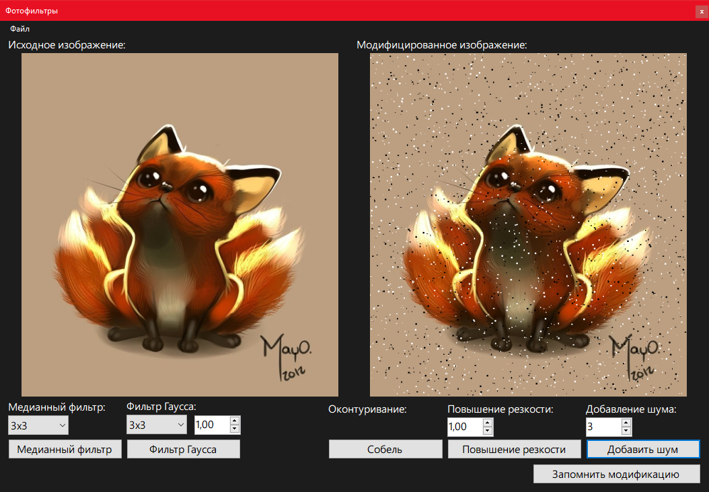
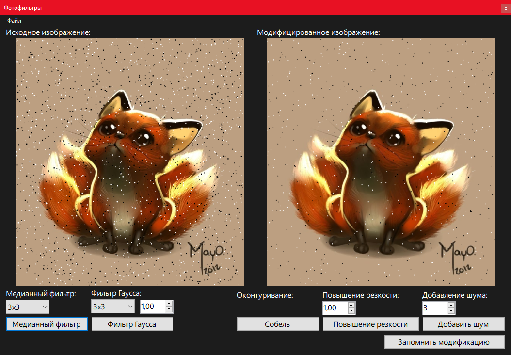
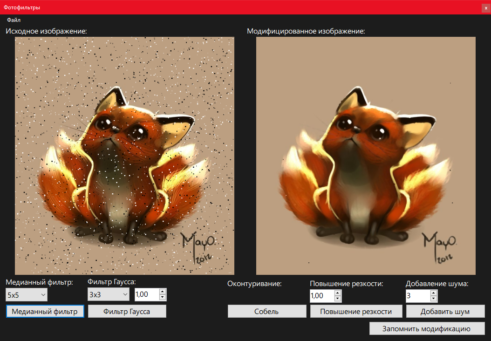
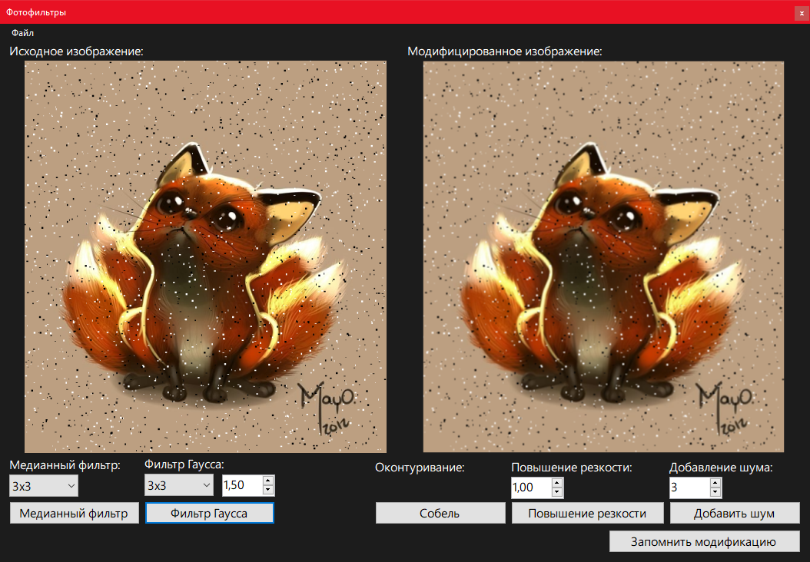
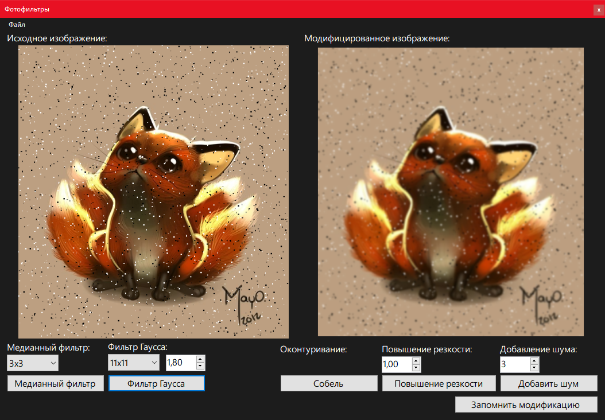
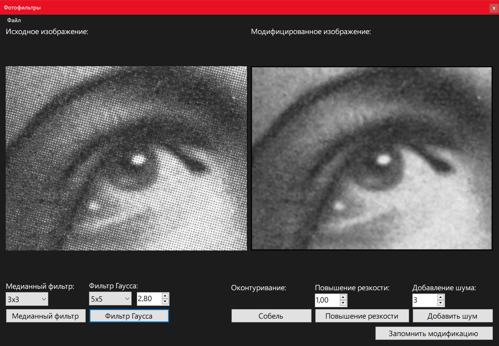
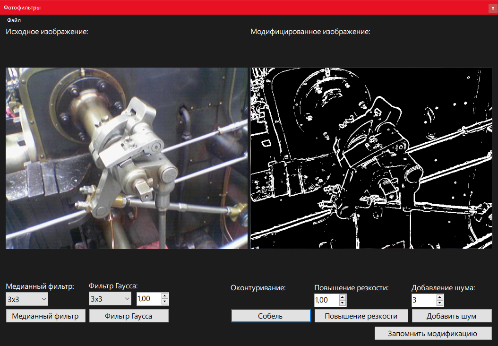
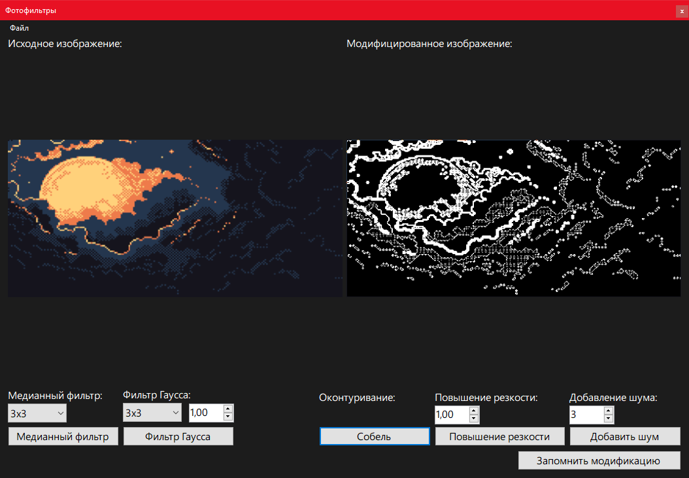
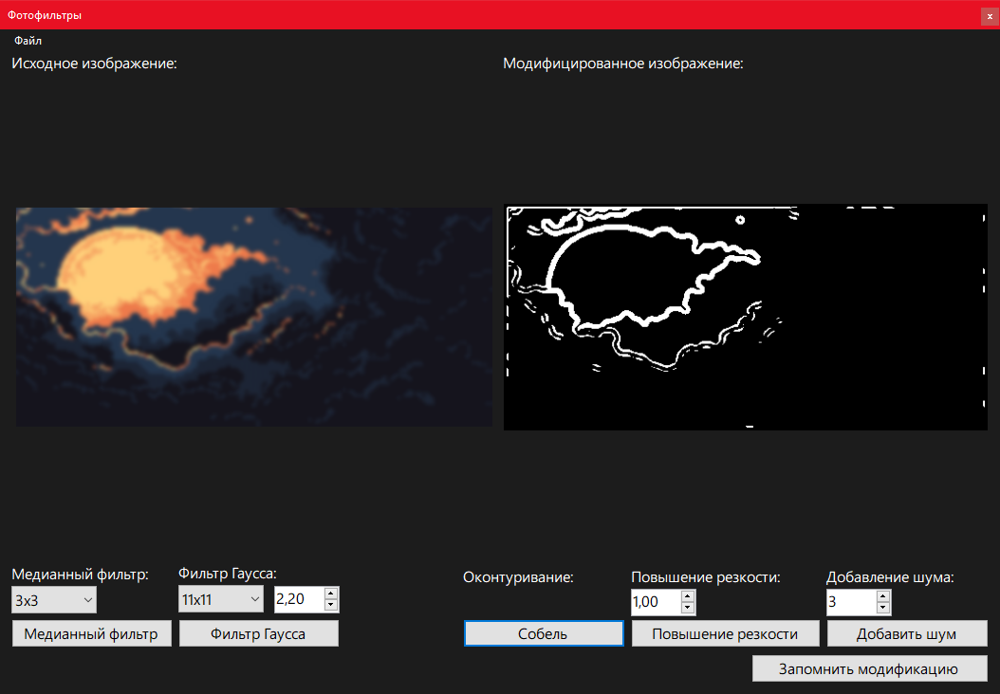
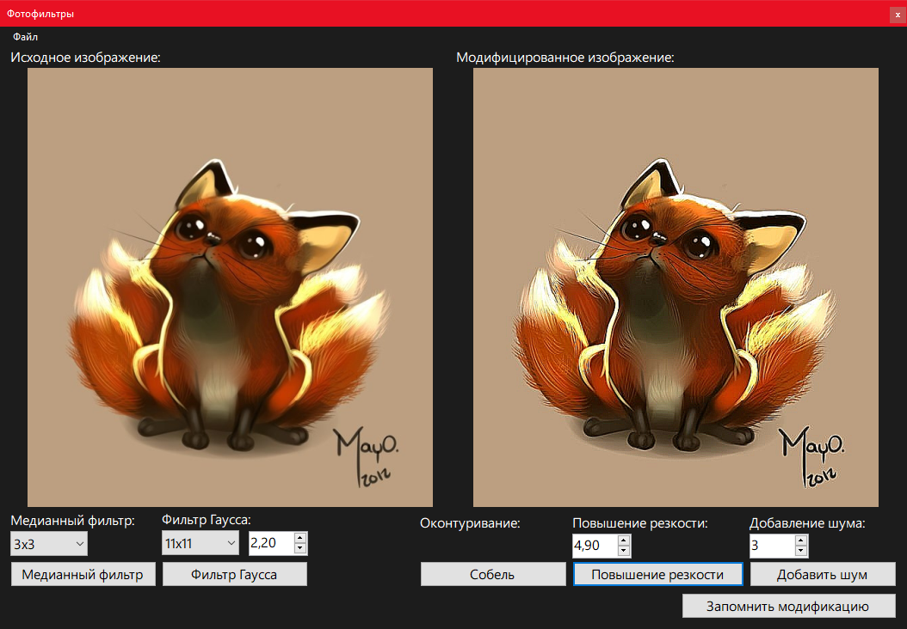

# Лабораторная работа по теме «Фильтрация фотоизображения. Подавление шумов на фотографиях» по дисциплине «Компьютерная графика»

## Задание

Для произвольного фотоизображения реализовать механизм коррекции и использованием фильтрации:
1. Искусственное наложение шума (точки, линии, окружности);
2. Сравнение фильтров шумоподавления со сменой аппертуры:
   - Медианный и гаусса
3. Сравнение методов повышения резкости;
4. Применение спецэффектов:
	- Оконтуривание (любым методом)

## Выполнение работы

Добавление шума:

Результат работы медианного фильтр 3х3:

Результат работы медианного фильтра 5х5:

Результат работы медианного фильтра 7х7:

Медианный фильтр 7х7 справился лучше всего с удалением шума, но изображение стало более размытым. Если бы добавленный шум был меньшего размера, например, точки 1 пиксель, то было бы достаточно применить медианный фильтр 3х3. Если бы добавленные точки были большего размера, то пришлось бы использовать медианный фильтр от 9х9 до 15х15.

Результат работы фильтра Гаусса для данного шума. 

Фильтр Гаусса не подходит для удаления данного шума, т.к. данный шум (точки) – это импульсные помехи.

Фильтр Гаусса размывает изображение:

Результат работы Оператора Собеля:

Результат работы Оператора Собеля для изображения в пиксельном стиле:

Результат Оператора Собеля, если предварительно воспользоваться фильтром Гаусса:

Повышение резкости:

